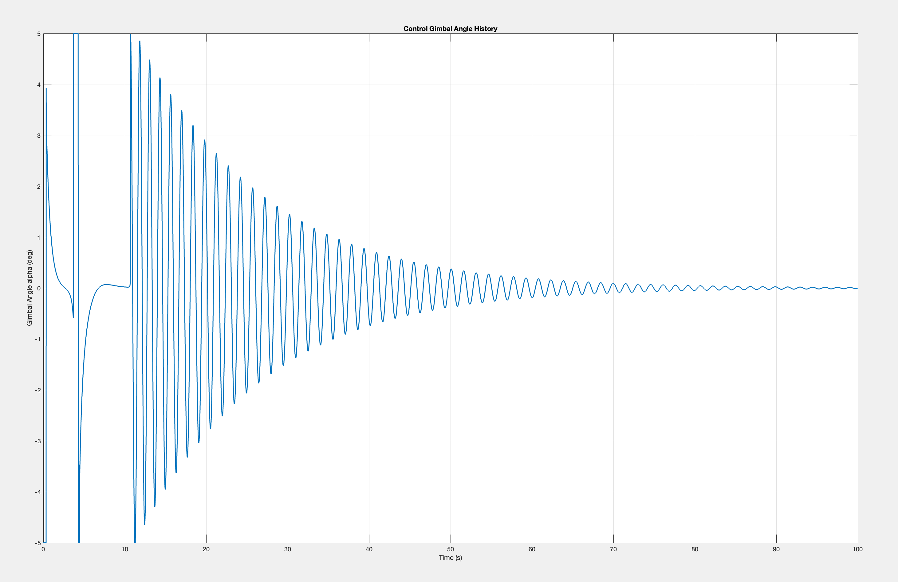
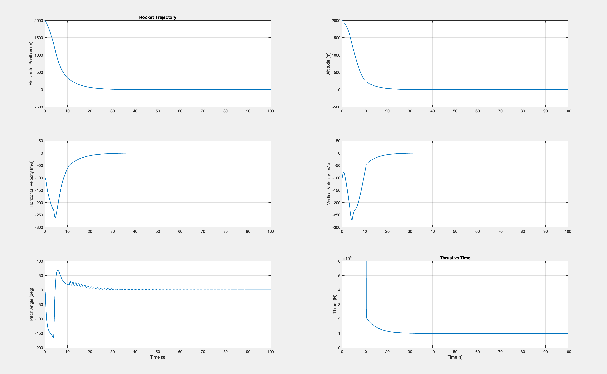
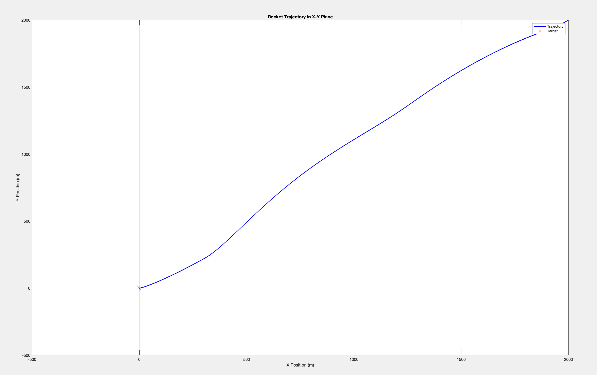

# Rocket Landing Simulation in MATLAB

A comprehensive 2D rocket landing simulation using PID control for autonomous guidance and landing. This project simulates a rocket with gimbaled thrust vector control attempting to land at a specified target position.

## Table of Contents
- [Overview](#overview)
- [System Dynamics](#system-dynamics)
- [Control System](#control-system)
- [Mathematical Formulation](#mathematical-formulation)
- [Files Description](#files-description)
- [Parameters](#parameters)
- [Results](#results)
- [Installation and Usage](#installation-and-usage)
- [Future Improvements](#future-improvements)

## Overview

This simulation models a rocket equipped with:
- **Gimbaled engine** for thrust vector control
- **PID controllers** for position and attitude control
- **6-DOF dynamics** (position, velocity, and attitude)
- **Realistic physical constraints** including thrust limits and gimbal angle limits

The rocket starts from an initial position with velocity and attempts to land at the origin (0,0) using feedback control.

## System Dynamics

The rocket is modeled as a rigid body with the following state vector:
```
x = [x_pos, y_pos, v_x, v_y, θ, ω]ᵀ
```

Where:
- `x_pos`, `y_pos`: Position coordinates (m)
- `v_x`, `v_y`: Velocity components (m/s)
- `θ`: Pitch angle (rad)
- `ω`: Angular velocity (rad/s)

### Dynamic Equations

The rocket dynamics are governed by:

**Translational Motion:**
```
ẍ = (T/m) × sin(θ + α) + wind_x/m
ÿ = (T/m) × cos(θ + α) - g + wind_y/m
```

**Rotational Motion:**
```
θ̈ = (T × r × sin(α)) / I
```

Where:
- `T`: Thrust magnitude (N)
- `α`: Gimbal angle (rad)
- `m`: Rocket mass (kg)
- `I`: Moment of inertia (kg⋅m²)
- `r`: Distance from center of mass to engine (m)
- `g`: Gravitational acceleration (m/s²)

## Control System

The control system consists of three cascaded PID controllers:

### 1. Position Control (Outer Loop)

**Vertical Control:**
```
e_y = y_pos - y_target
a_y = -K_p,y × e_y - K_d,y × vy - K_i,y × ∫e_y dt + g
```

**Horizontal Control:**
```
e_x = x_pos - x_target  
a_x = -K_p,x × e_x - K_d,x × vx - K_i,x × ∫e_x dt
```

### 2. Thrust Magnitude Calculation

From the desired accelerations:
```
T_total = m × √(a_x² + a_y²)
θ_desired = atan2(a_x, a_y)
```

### 3. Attitude Control (Inner Loop)

```
e_θ = θ - θ_desired
α = -(K_p,θ × e_θ + K_d,θ × ω + K_i,θ × ∫e_θ dt)
```



The gimbal angle shows the control effort required to maintain stable flight and landing approach.

## Files Description

### `main.m`
- Main simulation script
- Initializes parameters and initial conditions
- Runs the simulation loop using ODE45
- Generates plots and visualization

### `pidController.m`
- Implements the three-tier PID control system
- Calculates thrust magnitude and gimbal angle
- Includes integral windup protection
- Returns control commands (T, α)

### `rocketODE.m`
- Defines the system dynamics
- Implements the differential equations
- Called by ODE45 solver for numerical integration

## Parameters

### Physical Parameters
- **Mass (m)**: 1000 kg
- **Moment of Inertia (I)**: 500 kg⋅m²
- **Engine Distance (r)**: 1.0 m
- **Maximum Thrust (T_max)**: 60,000 N
- **Gimbal Limit**: ±5°

### PID Gains
```matlab
% Position Control
Kp_y = 10,   Kd_y = 50,   Ki_y = 0.01    % Vertical
Kp_x = 10,   Kd_x = 60,   Ki_x = 0.01    % Horizontal

% Attitude Control  
Kp_θ = 2,    Kd_θ = 1,    Ki_θ = 0.01    % Pitch
```

### Initial Conditions
- **Position**: (2000, 2000) m
- **Velocity**: (-100, -100) m/s
- **Attitude**: 0° pitch
- **Target**: (0, 0) m

## Results

### Trajectory Analysis



The simulation results show:

1. **Position Tracking**: Both horizontal and vertical positions converge to the target
2. **Velocity Profile**: Velocities approach zero as the rocket lands
3. **Attitude Control**: Pitch angle stabilizes around the desired orientation
4. **Thrust Profile**: Shows the control effort throughout the landing sequence

### Landing Performance



The X-Y trajectory plot demonstrates successful guidance from the initial position (2000, 2000) to the target landing site at the origin.

**Key Performance Metrics:**
- **Landing Accuracy**: Successfully reaches target coordinates
- **Velocity at Landing**: Approaches zero for soft landing
- **Control Stability**: Gimbal angle remains within ±5° limits
- **Convergence Time**: Approximately 40-50 seconds

## Installation and Usage

### Prerequisites
- MATLAB R2018b or later
- Control System Toolbox

### Running the Simulation

1. Download all three MATLAB files to the same directory
2. Open MATLAB and navigate to the project directory
3. Run the main simulation:
   ```matlab
   main
   ```
4. The simulation will generate three figures showing:
   - Time-series plots of all state variables
   - Rocket trajectory in the X-Y plane  
   - Control input histories

### Customization

Modify parameters in `main.m`:
```matlab
% Change initial conditions
x(:,1) = [x0; y0; vx0; vy0; theta0; omega0];

% Adjust target location
params.x_target = target_x;
params.y_target = target_y;

% Tune PID gains
params.Kp_y = new_value;
```

## Future Improvements

### 1. Enhanced Gimbal Angle Stabilization

### 2. Additional Enhancements
- **3D Simulation**: Extend to three dimensional dynamics
- **Sensor Noise**: Add realistic sensor models and noise
- **Wind Disturbances**: Implement time-varying wind fields
- **Fuel Consumption**: Model propellant mass depletion
- **Real-time Visualization**: Add animated rocket visualization during simulation

## Contributing

Feel free to contribute improvements or report issues. Areas of particular interest:
- Control system optimization
- Enhanced visualization
- Additional physical effects
- Performance metrics

## License

This project is open source and available under the MIT License.

---

**Note**: This simulation is for educational and research purposes. Real rocket control systems require extensive safety analysis, redundancy, and testing that are beyond the scope of this project.
